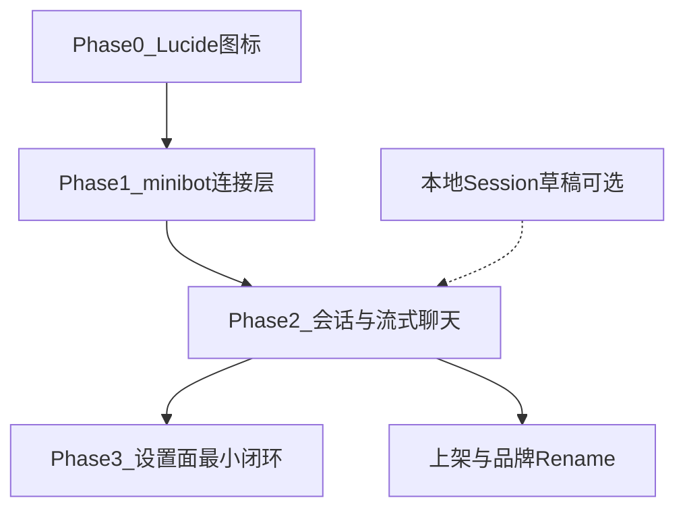

# Minibot React Native — 待办总览

> 规划说明索引，详细方案见各子文档。  
> 更新时间：2026-07-30

**产品方向**：对接 sibling [minibot](https://github.com/liuyidi/minibot) server（`:8766`），做成 webui 的移动端客户端。详见主路线图。

---

## 文档索引

| 文档 | 内容 | 状态 |
|------|------|------|
| [minibot-mobile-roadmap.md](./minibot-mobile-roadmap.md) | **主路线图**：差距分析、Phase 0–4、验收标准 | 现行 |
| [chat-session-storage.md](./chat-session-storage.md) | 本地 Session 草稿/缓存（权威数据仍以 minibot 为准） | 参考，服务 Phase 2 |
| [app-release-china.md](./app-release-china.md) | 国内 iOS / Android 上架与合规 | 后期，与 chat 解耦 |
| [backend-fastapi-railway.md](./backend-fastapi-railway.md) | 自建 FastAPI + Railway | **已废弃** |

---

## 现状摘要

| 模块 | 当前状态 |
|------|----------|
| 聊天 | **已连 minibot 时走 WS 主路径**（newChat / attach / delta / turn_end / abort）；未连接时回落 DeepSeek SSE |
| 传输 | `@minibot/client`：bootstrap + REST sessions + WS multiplex |
| 会话 | 已连接：远端 `sessions.list` + `getThread`；离线：本地 AsyncStorage 草稿 |
| 服务器设置 | 「我的 → Minibot 服务器」：Base URL / Secret / 连接 / sessions 探测 |
| 本地存储 | DeepSeek API Key → SecureStore；minibot URL → AsyncStorage；离线会话草稿 → AsyncStorage |
| 账号 | `deepseek-chat-api` 登录 + guest；与 minibot gateway auth 不同模型 |
| 图标 | lucide-react-native（Phase 0 完成） |
| 发布 | Expo SDK 54，`bundleIdentifier: com.liuyidi.deepseekchat`；已有 `eas.json` |

---

## 依赖关系

---

## 推荐实施顺序

1. **[Phase 0 Lucide](./minibot-mobile-roadmap.md#phase-0--lucide-图标统一第一步)** — 统一图标，对齐 webui
2. **[Phase 1 连接层](./minibot-mobile-roadmap.md#phase-1--minibot-连接层地基)** — bootstrap + REST 子集 + WS
3. **[Phase 2 聊天主路径](./minibot-mobile-roadmap.md#phase-2--会话列表--聊天主路径移动端核心)** — Session 列表 + 流式替换 DeepSeek
4. **[Phase 3 设置](./minibot-mobile-roadmap.md#phase-3--设置面最小闭环对齐-webui-demo-入口)** — overview / appearance / models / runtime
5. **[上架](./app-release-china.md)** — 有稳定 chat 后再做；品牌 rename 单独 PR

---

## 已拍板事项

| # | 问题 | 结论 |
|---|------|------|
| 1 | 后端用谁？ | **minibot server**，不用自建 Railway FastAPI |
| 2 | API Key 谁持有？ | 长期：**服务端 provider 配置**；端上 DeepSeek 直连仅过渡 |
| 3 | Session 列表 UI？ | **Chat Tab + 左滑 Drawer**（少改 Tab） |
| 4 | webui 移动端化？ | **RN 原生客户端**为主；webui SPA 仅作 UX/API 参考 |

## 仍待决策（可延后）

| # | 问题 | 选项 |
|---|------|------|
| 1 | 过渡期是否保留 DeepSeek 直连 demo？ | 保留开关 / 硬切 minibot |
| 2 | email 登录（deepseek-chat-api）是否保留？ | 隐藏 / 删除 / 作为可选账号层 |
| 3 | 国内正式服 | 复用已有 demo 部署 / 另开 |
| 4 | 应用主体 / bundle 改名时机 | 与 Phase 2 后 rename PR 一起 |
