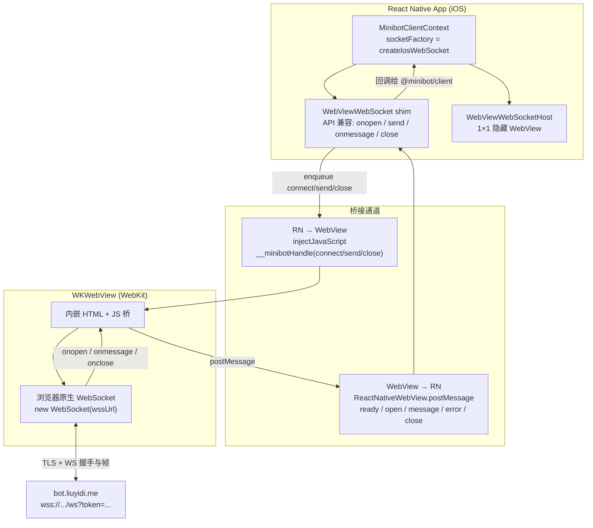
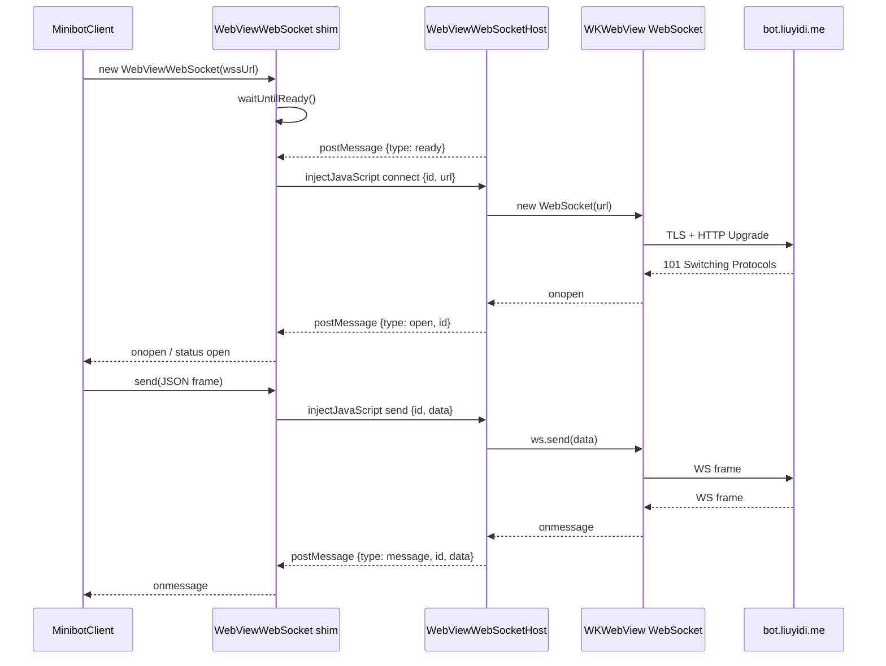

# Expo Go iOS 连接 `wss://bot.liuyidi.me` 失败排查记录

日期：2026-07-31  
现象：真机 Safari 打开 `https://bot.liuyidi.me/ui/` 可正常聊天；Expo Go（SDK 54）连接同一网关时 WebSocket 报 `1006` / `OSStatus error -9806`。  
结论：**不是 nginx/TLS 配置问题**；根因是 React Native iOS 的 SocketRocket（NSStream）在较新系统上本地中止 WSS 握手。Expo Go 只是把该原生栈打进二进制且无法替换。修复：iOS 用隐藏 WebView（WebKit）桥接 WebSocket。

---

## 1. 症状与对照

| 客户端 | HTTPS `/webui/bootstrap` | WSS `/ws` |
|--------|--------------------------|-----------|
| iPhone Safari / Chrome | 成功 | 成功（nginx access 有 `101`） |
| Expo Go（同一手机 IP） | 成功（UA: `Expo/... CFNetwork/...`） | **失败**；access log **从未出现** Expo 的 `/ws` |

App 侧错误形态：

```text
WARN  [minibot ws] onclose 1006 The operation couldn’t be completed. (OSStatus error -9806.)
```

`-9806` = `errSSLClosedAbort`（连接因错误被中止），本身不说明是证书、协议还是应用主动 RST。

---

## 2. 曾尝试但无效/方向错误的改动（已复原）

这些改动曾被当成「根因修复」落地，但与最终证据不符，**nginx / Certbot SSL 相关项已复原**：

1. **强制 `ssl_protocols TLSv1.2` only**（含改 `/etc/letsencrypt/options-ssl-nginx.conf`）  
   - 注意：nginx 的 `ssl_protocols` 在同一 context 里是**合并**不是覆盖；只在 server block 再写一行 `TLSv1.2` 往往去不掉 include 里的 `TLSv1.3`。
2. **去掉 `http2`、收紧 cipher、重签证书换链** 等 TLS 周边调整。
3. **给 RN WebSocket 加空 `protocols: []` + 自定义 User-Agent + Proxy 包一层**  
   - 引入过 `ErrorEvent` 在 RN 不存在的噪音；也不是握手失败主因。
4. **关闭 Uvicorn `permessage-deflate`**  
   - 握手响应里确实出现过 `Sec-WebSocket-Extensions: permessage-deflate...`，但对「TLS 阶段就被 RST、access 无 `/ws`」解释不通。该项属于应用层兼容性加固，可保留；与 nginx 复原无关。

---

## 3. 关键证据（按时间线）

### 3.1 分层对照

- Expo **能**完成 `GET /webui/bootstrap` → 域名、证书、ATS、网络路径对 **NSURLSession/CFNetwork 的 HTTPS** 是通的。
- 同一 IP 的 Safari **能**完成 `GET /ws` → `101` → 服务端 WebSocket 与 nginx upgrade 正常。
- Expo **从不**出现在 `/ws` access log → 失败发生在 **HTTP Upgrade 之前**（TLS/本地协议栈）。

### 3.2 tcpdump（钉死行为）

对手机 IP `115.205.40.11` 抓 443：

1. TCP 三次握手成功  
2. 客户端发出 **174 字节 TLS ClientHello**（`16 03 01 ...`，TLS 1.2，SNI=`bot.liuyidi.me`）  
3. 服务端仅 TCP ACK  
4. 客户端在约 **0.02ms 内连发 RST**  
5. **服务端来不及发出 ServerHello**

同机 HTTPS（长连接端口）仍在正常收发；只有新建的 WSS 连接被 RST。

### 3.3 ClientHello 内容

解码后要点：

- 版本：TLS 1.2（无 TLS 1.3）
- SNI：`bot.liuyidi.me`
- 曲线：secp256r1 / secp384r1 / secp521r1（无 X25519）
- 密码套件：含 `ECDHE-RSA-AES128-GCM-SHA256` 等，与当时 nginx cipher 列表有交集

### 3.4 服务端重放

把抓到的同一份 ClientHello 原样发到 `127.0.0.1:443`：

- **约 0.4ms** 收到 TLS Handshake（ServerHello）

因此服务器可以正常响应该 ClientHello；手机侧是 **本地中止**，不是 nginx 拒握手。

### 3.5 客户端栈差异：RN / SocketRocket vs Expo

**主要是 React Native（SocketRocket）的问题，不是 Expo 单独搞坏的。**

| 层级 | 角色 |
|------|------|
| **React Native iOS** | `RCTWebSocketModule.mm` 仍走 **SocketRocket**（`NSStream` / SecureTransport），不是 Safari/WebKit，也不是普通 `fetch` 的 NSURLSession，更不是 `URLSessionWebSocketTask`。本次依赖为 RN `0.81.5`（Expo SDK 54）。 |
| **Expo Go** | 把上述原生模块打进 Expo Go 二进制；**JS 层没有另写一套坏掉的 WSS**。真正限制是：Expo Go 里**换不了**原生 WebSocket，只能 WebView 绕过或上 Dev Client。 |
| **是否“已知版本 bug”** | SocketRocket **有**公开 TLS 相关坑（尤其历史上对 TLS 1.3 支持差）。本次是 **TLS 1.2 ClientHello 发出后本地立刻 RST**，与“服务器只开 TLS 1.3”不完全同型，更像 **SocketRocket × 较新 iOS SecureTransport** 兼容问题。未找到与「ClientHello 后约 0.02ms RST + Safari 正常」完全对得上的官方 issue 编号，不宜写成已确认的某版本 CVE。 |

推论：同一 RN 版本的裸工程 / EAS 正式包，若仍用原生 `WebSocket`，**很可能同样挂**；Expo 的锅主要是 **Expo Go 没法打原生补丁**。

在较新的 iOS（本次环境含 iOS 18.x / CFNetwork 3860）上，SocketRocket 路径对 `wss://` 会本地 abort；**同一设备上 WebKit WebSocket（Safari / WKWebView）正常**。

---

## 4. 最终修复（保留）

仓库：`minibot-react-native`

| 文件 | 作用 |
|------|------|
| `lib/minibot/webviewWebSocket.ts` | WebSocket 兼容 shim；真实连接在 WebView 内用 WebKit `WebSocket` |
| `components/WebViewWebSocketHost.tsx` | 1×1 隐藏 WebView 宿主 |
| `context/MinibotClientContext.tsx` | iOS 使用 `createIosWebSocket`；Android 仍用原生 `WebSocket` |

日志特征（成功时应看到）：

```text
[minibot ws] iOS WebKit bridge → wss://bot.liuyidi.me/ws?token=...
[minibot ws] status open
```

### 4.1 WebView WebSocket 桥接流程

思路：JS 侧假装自己是 `WebSocket`；真正的 `new WebSocket(wssUrl)` 跑在隐藏 `WKWebView` 里（与 Safari 同一 WebKit 栈）；两侧用 `injectJavaScript` / `postMessage` 传命令与事件。



连接时序（简化）：



---

## 5. 以后再排查同类问题的清单

1. **先对照**：同设备 Safari WSS vs App WSS；access log 里有没有 App 的 `/ws`。  
2. **若 HTTPS 通、WSS 无 access 记录**：优先怀疑客户端 TLS/WebSocket 实现，而不是再改一圈证书。  
3. **抓包**：看 ClientHello 之后是 ServerHello 还是客户端 RST。  
4. **确认 RN iOS 仍是 SocketRocket**：不要默认当成 `URLSessionWebSocketTask`。  
5. **区分 RN vs Expo**：根因在 RN/SocketRocket；Expo Go 只是无法替换原生模块。绕过手段是 WebKit 桥、自定义 Dev Client，或改用非 WS 传输。

---

## 6. 配置复原说明

已复原：

- 仓库 `mini-langfuse/deploy/demo/nginx-subdomains.conf`：恢复 `listen 443 ssl http2`，去掉强制 TLS 1.2 only / 额外 cipher 块。  
- ECS `/etc/letsencrypt/options-ssl-nginx.conf`：从 `.bak` 恢复为 `ssl_protocols TLSv1.2 TLSv1.3;` 并 `nginx -t && reload`。

未回滚（与 nginx 无关、可保留）：

- App 侧 WebKit WebSocket 桥（真正修复）。  
- minibot `ws_per_message_deflate=False`（可选兼容项；不影响本次根因结论）。
