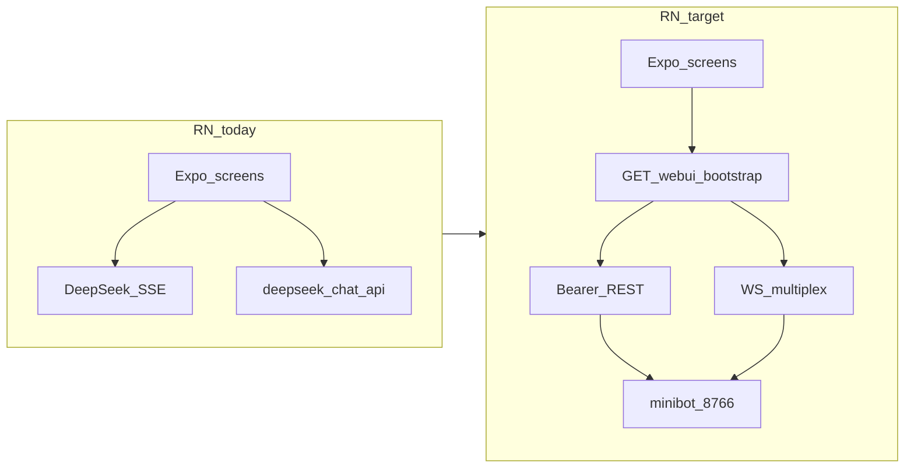

# Minibot React Native 后续执行计划

> 最终目标：用 sibling 仓库 [minibot](https://github.com/liuyidi/minibot) 的 **server 层**（FastAPI `:8766`），把本应用做成 **webui 的移动端客户端**。  
> 更新时间：2026-07-30

相关索引见 [TODO.md](./TODO.md)。

---

## 差距总览

当前 RN 应用仍是 **DeepSeek 直连聊天壳**；目标是 **minibot 的移动端 WebUI**。

| 维度 | RN 现状 | minibot + webui 目标 | 差距 |
|------|---------|----------------------|------|
| 后端 | DeepSeek `api.deepseek.com` SSE + `deepseek-chat-api` 登录 | minibot `:8766`（bootstrap + REST + WS） | **架构级重写** |
| 传输 | HTTP SSE，无 WebSocket | `GET /webui/bootstrap` → Bearer REST + `/ws?token=` 多路复用 | 需新 client |
| 会话 | 单页 `useState`，刷新丢失 | `/api/sessions` + attach/new_chat + thread 历史 | 无 session 模型 |
| Agent | 纯 LLM 对话 | Agent loop：工具、reasoning、turn、workspace | UI/协议大幅不足 |
| 设置 | 本地 API Key / model / thinking | overview、appearance、models/presets、runtime（对齐 webui `ui-entry.ts`） | 需改接 `/api/settings*` |
| 鉴权 | email/password + guest | gateway bootstrap token（可选 secret） | 模型不同 |
| 图标 | Ionicons + SF Symbols / `IconSymbol` | webui 已用 `lucide-react` | 可先统一 |
| 品牌 | `deepseek-chat` / DeepSeek 文案 | Minibot | 重命名与文案 |



**可复用**：Expo Router 壳、Appearance/Language Context、GiftedChat + markdown/reasoning 气泡、SecureStore/AsyncStorage 模式、嵌套 Settings stack。

**不可复用（需替换）**：`lib/deepseekChat.ts`、`lib/authApi.ts` 作为主路径、无 session 的 chat 状态机。

**契约真相源（实现时对照，均在 minibot 仓库 `docs/`）：**

- 统一合同大纲：`docs/client-api.md`
- 现状 / 路线图：`docs/status.md`、`docs/migration.md`
- 前端参考：`webui/src/lib/api.ts`、`bootstrap.ts`、`nanobot-client.ts`
- 后端：`minibot/src/minibot/api/ws.py`、`api/routes/sessions.py`、`settings.py`

**默认策略**：以 minibot 为主路径；DeepSeek 直连与 `deepseek-chat-api` 登录降级为过渡/可选 demo，不作为长期产品路径。旧的 [backend-fastapi-railway.md](./backend-fastapi-railway.md)（自建 Railway 后端）**已废弃**，改为对接本机/已部署的 minibot。

---

## Phase 0 — Lucide 图标统一（第一步）

与功能无关，改动面小、立刻对齐 webui 视觉语言（webui 依赖 `lucide-react`）。

**做法**

1. 安装 `lucide-react-native`（若缺则补 `react-native-svg`）。
2. 新增统一封装，例如 `components/ui/AppIcon.tsx`：`name` / `size` / `color` / `strokeWidth`，默认跟主题色。
3. 替换全部 Ionicons / MaterialCommunityIcons / tab 用 `IconSymbol`：
   - Tabs：`app/(tabs)/_layout.tsx` → `House` / `MessageCircle` / `User`
   - Settings 行：`SettingsNavRow` + 各 settings 页
   - Chat：composer send、preference chevron、empty state
   - Home 引导卡片
4. 废弃或薄封装旧 `IconSymbol`（避免双轨）。
5. 与 webui 常用图标对齐命名（`Plus`、`Settings`、`Moon`/`Sun`、`Bot`、`ChevronRight` 等），便于以后抄 webui 布局时少做映射表。

**验收**：iOS / Android / Web 三端图标一致；无残留 Ionicons 业务引用。

---

## Phase 1 — Minibot 连接层（地基）

在 RN 使用 **`@minibot/client`**（GitHub Packages：`npm:@liuyidi/minibot-client`），不要再手写第二套 bootstrap/WS。

| 模块 | 包 API | RN 落地 |
|------|--------|---------|
| Base URL | `createClient({ baseUrl })` | 默认 `https://bot.liuyidi.me`；可在设置覆盖 |
| Bootstrap | `client.bootstrap()` | SecureStore 存 token / expiry，过期再 bootstrap |
| REST | `client.sessions.*` | 列表 / 建会话 / `getThread` |
| WS | `client.ws` | `connect` → `newChat` / `attach` / `sendMessage` / `abort`；收 `delta` / `reasoning_*` / `message` / `turn_end` |

```bash
export NODE_AUTH_TOKEN=ghp_xxx   # read:packages
npm install
```

依赖：`"@minibot/client": "npm:@liuyidi/minibot-client@0.1.0"`（`.npmrc` 指向 `npm.pkg.github.com`）。

**验收**：连上 `https://bot.liuyidi.me`（或本地），`health` + `bootstrap` 成功，WS `open`，能 `newChat` 并收到至少一条流式 `delta`。

---

## Phase 2 — 会话列表 + 聊天主路径（移动端核心）

把「单页 DeepSeek」换成「webui 聊天信息架构的移动版」。

**UI 参考（webui → RN）**

- 会话列表：`ChatList.tsx` / Sidebar → RN：**Chat Tab 顶栏 + 左滑 Drawer / 独立 Session 列表屏**（推荐 Drawer，少改 Tab 结构）
- 线程：`webui/src/components/thread/*` → 继续 GiftedChat，但消息源改为 WS + `GET .../webui-thread`
- 连接态：`ConnectionBadge` → Chat 顶栏小点
- 本地草稿：可吸收 [chat-session-storage.md](./chat-session-storage.md) 做离线缓存，但 **权威数据在 minibot**

**功能切片**

1. Session 列表（pin/archive/rename 可二期）
2. 打开会话 attach + 拉 thread
3. 发送 `message`，渲染 `delta` / 最终 `message`
4. Reasoning 气泡（已有 `components/chat/ChatBubble.tsx` 可接 `reasoning_delta`）
5. Stop / abort
6. 新建会话

**暂缓**：tool_hint 完整时间线、file_edit、图片附件、voice、slash/MCP mention（Phase 4+）。

---

## Phase 3 — 设置面最小闭环（对齐 webui demo 入口）

对齐 minibot 仓库 `webui/src/lib/ui-entry.ts` 当前开放项：

| 设置 | webui | RN 动作 |
|------|-------|---------|
| appearance | theme / density… | 保留本地主题；可同步服务端 theme 字段若 API 有 |
| models | presets CRUD + activate | 替换「本地 DeepSeek model 列表」→ `/api/settings` + model-configurations |
| runtime | bot name / timezone | 新 settings 页 |
| overview | 跳转卡片 | settings 首页改造成 overview |
| API Key 页 | 用户直连 DeepSeek | 改为 **Provider/Model 配置**（密钥进 minibot，不进端上直连） |

登录：minibot 若启用 `REQUIRE_AUTH`，用 secret/bootstrap；email 注册体系可隐藏或仅作可选账号层。

---

## Phase 4+ — 功能参考清单（按需排期）

不必一次做完；下列均有现成 webui / minibot 参考：

| 能力 | 参考位置 | 移动端建议 |
|------|----------|------------|
| Tool / progress 气泡 | webui MessageBubble + WS `kind` | 折叠卡片，避免桌面级时间线 |
| Workspace 选择 | `WorkspaceControls` + `set_workspace_scope` | Settings 或 Chat 顶栏 ActionSheet |
| 模型切换 | Composer model badge | 沿用现有 preference bar，改读服务端 presets |
| Providers | minibot Phase 6 + DevUI `providers.html` | 设置子页；OAuth 移动端后置 |
| Automations / Skills / Apps | SettingsView 对应 section | 入口先藏（与 ui-entry 一致） |
| 语音转写 | `transcribe_audio`（nanobot 全；minibot 可能未齐） | 等服务端 parity |
| 图片附件 / 灯箱 | AttachmentTile / ImageLightbox | 后期 |
| Token usage | settings usage + heatmap | 简化列表即可 |
| 品牌重命名 | `app.json` / README / bundle id | 单独「Minibot」rename PR |

**webui「移动端化」含义**：主交付是 **RN 原生客户端**；webui 里已有的 sheet sidebar / 软键盘适配仅作交互参考，不把 Vite SPA 改造成主移动产品。若以后要 PWA，可另开文档。

---

## 建议实施顺序

1. **P0 Lucide**（1 个小 PR）
2. **P1 minibot client + 连通性烟测**（可先做 Dev 调试页或 Settings「服务器」）
3. **P2 会话 + 流式聊天替换 DeepSeek 主路径**
4. **P3 models / runtime / overview 设置**
5. **Rename / 上架** 与功能解耦，有稳定 chat 后再做（见 [app-release-china.md](./app-release-china.md)）

---

## 风险与注意

- Android 模拟器访问宿主机用 `10.0.2.2:8766`；真机需局域网 IP + minibot 监听 `0.0.0.0`。
- minibot WS 能力仍是 nanobot 子集（无 `fork_chat` / 完整 media）；RN 只实现已支持帧，避免假进度。
- GiftedChat 与 agent 多气泡（tool/reasoning）会别扭：中期可评估自研消息列表（对标 webui thread），P2 先能用即可。
- 勿把用户 DeepSeek Key 与 minibot provider key 两套并存搞乱；P3 起以服务端配置为准。
